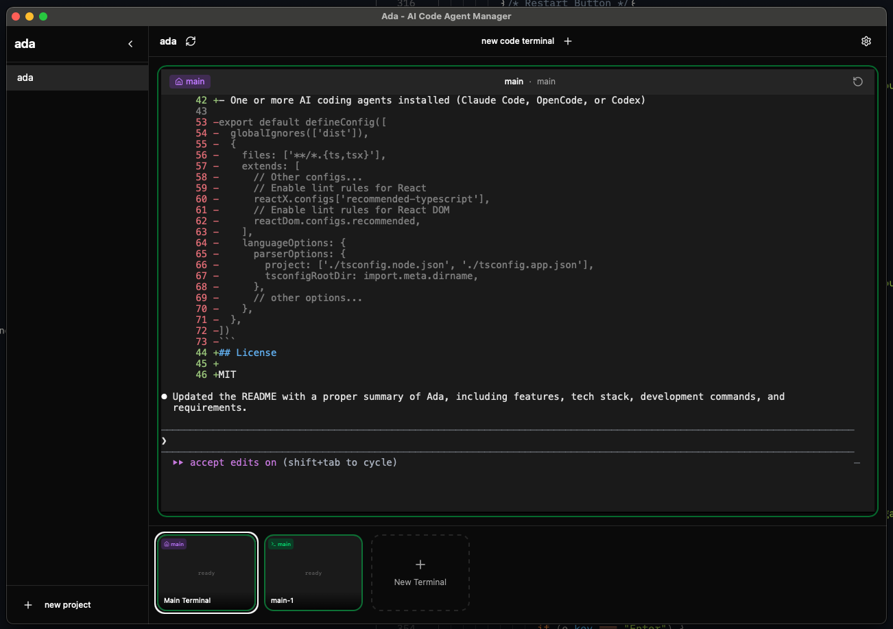
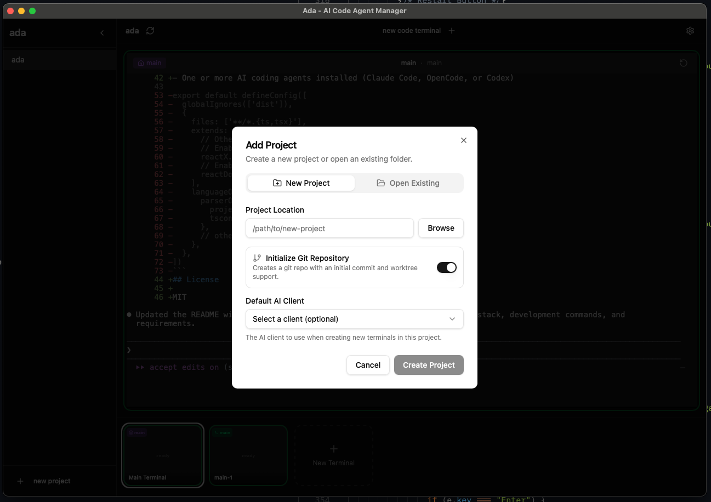
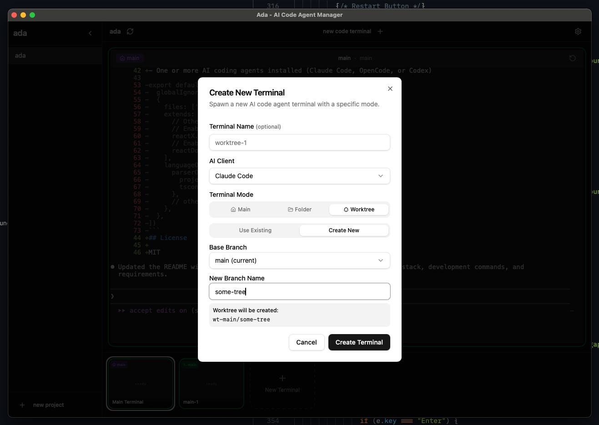

# Ada



Ada is a desktop application for managing multiple AI coding agents with integrated terminal support and git worktree workflows.

## Screenshots


*Create new projects or open existing folders with git initialization*


*Spawn AI agent terminals with worktree support for branch isolation*

## Features

- **Multi-Agent Support** - Manage Claude Code, OpenCode, and Codex agents from a single interface
- **Integrated Terminals** - Built-in terminal emulation with xterm.js for each agent session
- **Git Worktree Workflows** - Automatic worktree creation for branch isolation, keeping agents working in parallel without conflicts
- **Project Management** - Organize and switch between multiple projects with persistent settings
- **Session History** - Terminal output preserved across app restarts

## Tech Stack

- **Frontend:** React 19, TypeScript, Vite, Tailwind CSS v4
- **Backend:** Rust with Tauri 2
- **UI:** Radix UI + shadcn/ui
- **State:** Zustand
- **Routing:** TanStack Router
- **Terminal:** xterm.js with portable-pty

## Development

```bash
# Install dependencies
bun install

# Start development (frontend + Tauri)
bun run tauri:dev

# Build for production
bun run tauri:build

# Lint
bun run lint
```

## Requirements

- [Bun](https://bun.sh/) (or Node.js)
- [Rust](https://rustup.rs/)
- One or more AI coding agents installed (Claude Code, OpenCode, or Codex)

## License

MIT
